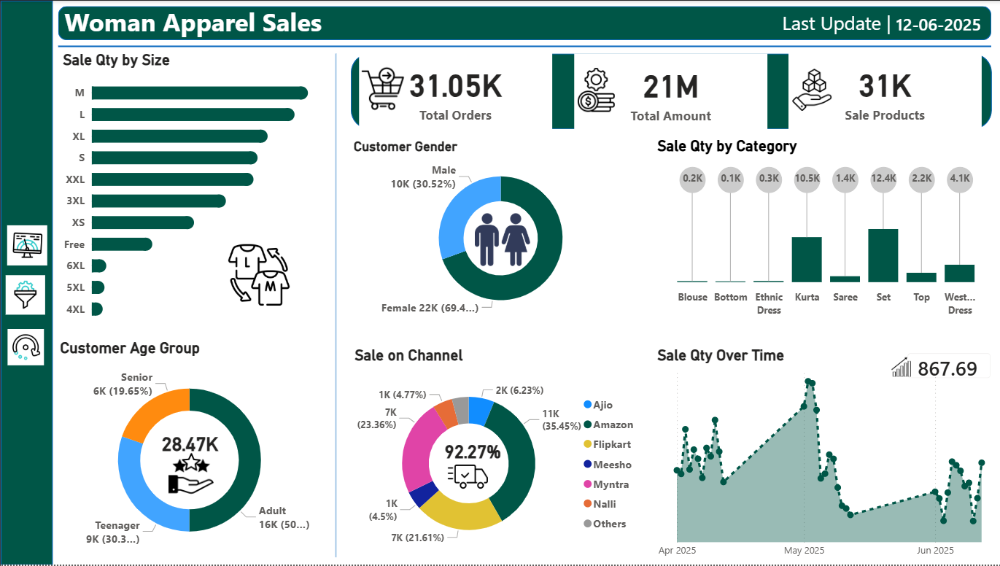

# Woman Apparel Sales Dashboard

A comprehensive Power BI dashboard for analyzing women's apparel sales performance, customer demographics, and sales trends across multiple channels.



## 📊 Dashboard Overview

This Power BI dashboard provides detailed insights into women's apparel sales with the following key metrics and visualizations:

### Key Performance Indicators
- **Total Orders**: 31.05K
- **Total Amount**: 21M
- **Sale Products**: 31K
- **Last Updated**: 12-06-2025

### Dashboard Features

#### 1. **Sales Analysis by Size**
- Distribution of sales quantity across sizes (M, L, XL, S, XXL, 3XL, XS, Free, 6XL, 5XL, 4XL)
- Visual representation of most popular sizes

#### 2. **Customer Demographics**
- **Gender Distribution**: 
  - Female: 22K (69.4%)
  - Male: 10K (30.52%)
- **Age Group Analysis**:
  - Adult: 16K (50%)
  - Teenager: 9K (30.3%)
  - Senior: 6K (19.65%)
  - Total Customers: 28.47K

#### 3. **Product Category Performance**
Sales quantity by category including:
- Kurta (highest performing)
- Set
- Saree
- Western Dress
- Top
- Ethnic Dress
- Bottom
- Blouse

#### 4. **Multi-Channel Sales**
Sales distribution across platforms (92.27% through primary channels):
- Amazon: 11K (35.45%)
- Myntra: 7K (23.36%)
- Flipkart: 7K (21.61%)
- Meesho: 1K (4.5%)
- Ajio: 2K (6.23%)
- Nalli: 1K (4.77%)
- Others

#### 5. **Time Series Analysis**
- Sales quantity trends from April 2025 to June 2025
- Average sales trend: 867.69 units
- Visual trend line showing sales patterns and seasonality

## 🛠️ Technologies Used

- **Microsoft Power BI Desktop**
- **DAX (Data Analysis Expressions)**
- **Power Query**

## 📁 Repository Structure

```
woman-apparel-sales-dashboard/
├── README.md
├── dashboard-preview.png
├── WomanApparelSales.pbix
```

## 🚀 Getting Started

### Prerequisites
- Microsoft Power BI Desktop (Latest version recommended)
- Windows 10 or later

### Installation & Usage

1. **Clone the repository**
   ```bash
   git clone https://github.com/yourusername/woman-apparel-sales-dashboard.git
   ```

2. **Open the dashboard**
   - Navigate to the cloned directory
   - Double-click on `WomanApparelSales.pbix`
   - The dashboard will open in Power BI Desktop

3. **Refresh Data** (if connected to live data source)
   - Click on "Refresh" in the Home tab
   - Enter credentials if prompted

4. **Interact with the Dashboard**
   - Use slicers and filters to explore different data segments
   - Hover over visualizations for detailed tooltips
   - Click on chart elements to cross-filter related visuals

## 📈 Data Sources

This dashboard analyzes sales data including:
- Order transactions
- Customer demographics
- Product categories and sizes
- Sales channels
- Time-based sales records

## 🎨 Dashboard Highlights

- **Clean, Professional Design**: Dark green and white color scheme for easy readability
- **Interactive Visualizations**: Cross-filtering capabilities across all charts
- **Comprehensive Metrics**: Multiple perspectives on sales performance
- **Mobile-Responsive**: Optimized for viewing on different screen sizes

## 📊 Use Cases

This dashboard is ideal for:
- E-commerce businesses selling women's apparel
- Retail analytics and business intelligence
- Inventory planning and management
- Marketing campaign analysis
- Sales performance tracking
- Customer behavior analysis

## 📝 License

This project is licensed under the MIT License - see the [LICENSE](LICENSE) file for details.

## 👤 Author

**Your Name**
- GitHub: [@Chandrashekhar569]([https://github.com/yourusername](https://github.com/Chandrashekhar569))
- LinkedIn: [Chandrashekhar Chaudhari](https://www.linkedin.com/in/chandrashekhar1997)

## 🙏 Acknowledgments

- Power BI community for inspiration and best practices
- Data visualization principles from industry standards
- E-commerce analytics frameworks

## 📧 Contact

For questions or feedback, please open an issue in the repository or contact [your-email@example.com]

---

**Note**: Replace sample data connections with your actual data sources before deployment. Ensure sensitive information is not included in the published dashboard.

## 🔄 Version History

- **v1.0.0** (Current) - Initial release with core sales analytics features
  - Customer demographics analysis
  - Multi-channel sales tracking
  - Time series analysis
  - Product category breakdown
  - Size distribution analysis

---

⭐ If you find this dashboard useful, please consider giving it a star!
